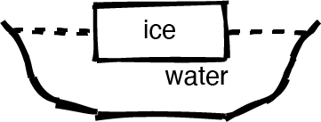

# Modelos mentales y evaluación formativa
La primera tarea en la enseñanza es descubrir quiénes son sus alumnos. Nuestro enfoque se basa en el trabajo de investigadores como Patricia Benner, quienes estudiaron cómo las enfermeras progresan de principiantes a expertos [Benn2000]. Benner identificó cinco etapas de desarrollo cognitivo que la mayoría de las personas atraviesan de manera bastante consistente. Para nuestros propósitos, simplificaremos esta progresión a tres etapas:

### Novicios
No saben lo que no saben, es decir, todavía no tienen un modelo mental utilizable del dominio del problema.

### Practicantes competentes
tener un modelo mental que sea adecuado para los propósitos cotidianos. Pueden realizar tareas normales con un esfuerzo normal en circunstancias normales y comprender los límites de su conocimiento (es decir, saben lo que no saben).

### Expertos
tienen modelos mentales que incluyen excepciones y casos especiales, lo que les permite manejar situaciones que están fuera de lo común. Discutiremos la experiencia con más detalle en el Capítulo 3.

Entonces, ¿qué es un **modelo mental**? Como su nombre indica, es una representación simplificada de las partes más importantes de algún dominio de problemas que es lo suficientemente buena como para permitir la resolución de problemas. Un ejemplo son los modelos de moléculas de bola y resorte utilizados en la química de la escuela secundaria. Los átomos no son en realidad bolas, y sus enlaces no son en realidad resortes, pero el modelo permite a las personas razonar sobre los compuestos químicos y sus reacciones. Un modelo más sofisticado de un átomo tiene una pequeña bola central (el núcleo) rodeada de electrones en órbita. También está mal, pero la complejidad adicional permite a las personas explicar más y resolver más problemas. (Al igual que el software, los modelos mentales nunca se terminan: solo se usan).

Presentar a un novato con un montón de hechos es contraproducente porque todavía no tienen un modelo para encajar esos hechos. De hecho, presentar demasiados hechos demasiado pronto puede reforzar el modelo mental incorrecto que han improvisado. Como [Mull2007a] observó en un estudio de instrucción en video para estudiantes de ciencias:

> Los estudiantes tienen ideas existentes sobre ... fenómenos antes de ver un video. Si el video presenta ... conceptos de una manera clara y bien ilustrada, los estudiantes creen que están aprendiendo, pero no se involucran con los medios en un nivel lo 
> suficientemente profundo como para darse cuenta de que lo que se presenta difiere de su conocimiento previo ... Sin embargo, hay esperanza. Presentar los conceptos erróneos comunes de los estudiantes en un video junto con los ... conceptos ha demostrado 
> que aumenta el aprendizaje al aumentar la cantidad de esfuerzo mental que los estudiantes gastan mientras lo ven.

Por lo tanto, su objetivo al enseñar a los novatos debe ser ayudarlos a construir un modelo mental para que tengan un lugar donde poner los hechos. Por ejemplo, la lección de Software Carpentry sobre el shell de Unix introduce quince comandos en tres horas. Ese es un comando cada doce minutos, que parece glacialmente lento hasta que te das cuenta de que el verdadero propósito de la lección no es enseñar esos quince comandos: es enseñar rutas, historia, finalización de tabulaciones, comodines, tuberías, argumentos de línea de comandos y redirección. Los comandos específicos no tienen sentido hasta que los novatos entiendan esos conceptos; Una vez que lo hacen, pueden comenzar a leer las páginas del manual, buscar las palabras clave correctas en la web y saber si los resultados de sus búsquedas son útiles o no.

Las diferencias cognitivas entre los principiantes y los profesionales competentes apuntalan las diferencias entre dos tipos de materiales didácticos. Un tutorial ayuda a los recién llegados a un campo a construir un modelo mental; un manual, por otro lado, ayuda a los profesionales competentes a llenar los vacíos en su conocimiento. Los tutoriales frustran a los profesionales competentes porque se mueven muy lentamente y dicen cosas que son obvias (aunque para los principiantes no son obvias) Igualmente, los manuales frustran a los principiantes porque usan jerga y no explican las cosas. Este fenómeno se llama efecto de reversión de experiencia [Kaly2003], y es una de las razones por las que tiene que decidir temprano para quién son sus lecciones.

> #### Un puñado de excepciones
> Una de las razones por las que Unix y C se hicieron populares es que [Kern1978, Kern1983, Kern1988] de alguna manera se las arreglaron para ser  buenos tutoriales y buenos manuales al mismo tiempo. [Fehi2008] y [Ray2014] se encuentran entre los pocos libros de computación que logran esta;  incluso después de releerlos varias veces, no sé cómo lo lograron.

## ¿Están aprendiendo las personas?
Mark Twain escribió una vez: "No es lo que no sabes lo que te mete en problemas. Es lo que sabes con certeza que no es así ". Por lo tanto, uno de los ejercicios para construir un modelo mental es eliminar las cosas que no pertenecen. En términos generales, los conceptos erróneos de los novatos se dividen en tres categorías:

**Errores de hecho**
Como creer que Vancouver es la capital de la Columbia Británica (es Victoria). Estos suelen ser fáciles de corregir.

**Modelos rotos**
Como creer que el movimiento y la aceleración deben estar en la misma dirección. Podemos abordar esto haciendo que los novatos razonen a través de ejemplos en los que sus modelos dan la respuesta incorrecta.

**Creencias fundamentales**
Como "el mundo tiene solo unos pocos miles de años" o "algunos tipos de personas son naturalmente mejores en programación que otros" [Guzd2015b, Pati2016]. Estos errores a menudo están profundamente conectados con la identidad social del alumno, por lo que resisten la evidencia y racionalizan las contradicciones.

Las personas aprenden más rápido cuando los maestros identifican y aclaran las ideas falsas de los alumnos a medida que se imparte la lección. Esto se llama **evaluación formativa** porque forma (o moldea) la enseñanza mientras se lleva a cabo. Los alumnos no aprueban ni reproban la evaluación formativa; en su lugar, brinda retroalimentación tanto al maestro como al alumno sobre qué tan bien lo están haciendo y en qué deben enfocarse a continuación. Por ejemplo, un profesor de música podría pedirle a un alumno que toque una escala muy lentamente para controlar su respiración. El alumno descubre si está respirando correctamente, mientras que el maestro recibe comentarios sobre si la explicación que acaba de dar tiene sentido.

> **Resumiendo**
>
>El contrapunto a la evaluación formativa es la evaluación sumativa, que tiene lugar al final de la lección. La evaluación sumativa es como una prueba de manejo: le dice al alumno si ha dominado el tema y al maestro si su lección fue exitosa. Una forma de pensar en la diferencia es que un chef que prueba la comida mientras la cocina es evaluaciones formativas, pero los invitados que la prueban una vez que se sirve es sumativa.
>
>Desafortunadamente, la escuela ha capacitado a la mayoría de las personas para que crean que toda evaluación es sumativa, es decir, que si algo se siente como una prueba, un mal desempeño contará en su contra. Hacer que las evaluaciones formativas se sientan informales ayuda a reducir esta ansiedad; En mi experiencia, el uso de cuestionarios en línea, clics o cualquier otra cosa parece aumentarlo, ya que la mayoría de las personas creen que todo lo que hacen en la web se está viendo y grabando.

Para ser útil durante la enseñanza, una evaluación formativa debe ser rápida de administrar (para que no interrumpa el flujo de la lección) y tener una respuesta correcta inequívoca (para que pueda usarse con grupos). El tipo de evaluación formativa más utilizado es probablemente la pregunta de opción múltiple (MCQ). Muchos maestros tienen una baja opinión de ellos, pero cuando están bien diseñados, pueden revelar mucho más que solo si alguien conoce hechos específicos. Por ejemplo, suponga que está enseñando a los niños cómo hacer una suma de varios dígitos [Ojos2015] y les da esta MCQ:

> **What is 37 + 15?**
>
>a) 52
>b) 42
>c) 412
>d) 43

La respuesta correcta es 52, pero las otras respuestas proporcionan información valiosa:

* Si el niño elige 42, no entiende lo que significa "cargar". (Ella bien podría escribir 12 como las respuestas a 7 + 5, luego sobrescribir el 1 con el 4 que obtiene de 3 + 1).

* Si elige 412, está tratando cada columna de números como un problema separado. Esto todavía está mal, pero está mal por una razón diferente.

* Si elige 43, entonces sabe que tiene que cargar el 1, pero lo está llevando de vuelta a la columna de la que proviene. Nuevamente, este es un error diferente y requiere una explicación clarificadora diferente del maestro.

Cada una de estas respuestas incorrectas es un distractor plausible con poder de diagnóstico. Un distractor es una respuesta incorrecta o menos que mejor; "Plausible" significa que parece que podría ser correcto, mientras que "poder de diagnóstico" significa que cada uno de los distractores ayuda al maestro a descubrir qué explicar junto a ese alumno en particular.

La difusión de las respuestas a una evaluación formativa guía lo que haces a continuación. Si suficiente de la clase tiene la respuesta correcta, sigue adelante. Si la mayoría de la clase elige la misma respuesta incorrecta, debe regresar y trabajar para corregir el error que señala el distractor. Si sus respuestas se dividen equitativamente entre varias opciones, probablemente solo estén adivinando, por lo que debe respaldar y volver a explicar la idea de una manera diferente. (Repetir exactamente la misma explicación probablemente no sea útil, lo cual es una de las cosas que hace que muchos cursos de video sean pedagógicamente ineficaces).

¿Qué pasa si la mayoría de la clase vota por la respuesta correcta pero algunos votan por la incorrecta? En ese caso, debe decidir si debe pasar tiempo atrapando a la minoría o si es más importante mantener a la mayoría comprometida. No importa cuán duro trabaje o qué prácticas de enseñanza use, no siempre podrá brindar a todos lo que necesitan; es su responsabilidad como maestro hacer la llamada.

>**¿De dónde vienen las respuestas incorrectas?**
>
>Para encontrar distractores plausibles, piense en las preguntas que hicieron sus alumnos o en los problemas que tuvieron la última vez que enseñó esta materia. Si no lo ha enseñado antes, piense en sus propios conceptos erróneos, pregunte a sus colegas sobre sus experiencias o mire la historia de su campo: si todos entendieron mal su tema de alguna manera hace cincuenta años, lo más probable es que muchos de sus los estudiantes todavía lo entenderán mal de esa manera hoy. También puede hacer preguntas abiertas en clase para recopilar ideas erróneas sobre el material que se cubrirá en una clase posterior, o consultar sitios de preguntas y respuestas como Quora o Stack Overflow para ver con qué se confunden las personas que aprenden el tema en otra parte.

El desarrollo de evaluaciones formativas mejora sus lecciones porque lo obliga a pensar en los modelos mentales de sus alumnos. En mi experiencia, una vez que hago esto, escribo automáticamente la lección para cubrir los vacíos y errores más probables. Por lo tanto, las evaluaciones formativas dan sus frutos incluso si no se utilizan (aunque la enseñanza es más efectiva si lo son).

Las MCQ no son el único tipo de evaluación formativa: el Capítulo 12 describe otros tipos de ejercicios que son rápidos e inequívocos. Lo que elija, debe hacer algo que tome uno o dos minutos cada 10–15 minutos para asegurarse de que sus alumnos realmente estén aprendiendo. Este ritmo no se basa en un límite de atención intrínseco: [Wils2007] encontró poco apoyo para la afirmación repetida a menudo de que los alumnos solo pueden prestar atención durante 10-15 minutos. En cambio, la directriz asegura que si un número significativo de personas se ha quedado atrás, solo tiene que repetir una pequeña parte de la lección. Las evaluaciones formativas frecuentes también mantienen a los alumnos interesados, especialmente si involucraron discusiones en grupos pequeños (Sección 9.2).

Las evaluaciones formativas también se pueden usar antes de las lecciones. Si comienza una clase con un MCQ y todos responden correctamente, puede evitar explicar algo que sus alumnos ya saben. Este tipo de enseñanza activa te da más tiempo para concentrarte en cosas que no saben. También muestra a los alumnos que respetas su tiempo lo suficiente como para no desperdiciarlo, lo que ayuda con la motivación (Capítulo 10).

>**Inventarios conceptuales**
>
>Con suficientes datos, las MCQ pueden hacerse sorprendentemente precisas. El ejemplo más conocido es el Force Concept Inventory [Hest1992], que evalúa la comprensión de la mecánica newtoniana básica. Al entrevistar a un gran número de encuestados, correlacionar sus conceptos erróneos con patrones de respuestas correctas e incorrectas, y luego mejorar las preguntas, sus creadores construyeron una herramienta de diagnóstico que puede identificar conceptos erróneos específicos. Los investigadores pueden usar esa herramienta para medir el efecto de los cambios en los métodos de enseñanza [Hake1998].
>
>Tew y otros desarrollaron y validaron una evaluación independiente del lenguaje para la programación introductoria [Tew2011], [Park2016] la replicó y [Hamo2017] está desarrollando un inventario conceptual para la recursividad. Sin embargo, es muy costoso crear herramientas como esta, y la capacidad de los alumnos para buscar respuestas en línea es una amenaza cada vez mayor para su validez.

Trabajar evaluaciones formativas en clase solo requiere un poco de preparación y práctica. Dar a los alumnos tarjetas coloreadas o numeradas para que todos puedan responder a un MCQ a la vez (en lugar de levantar las manos por turnos), tener una de las opciones: "No tengo idea" y animarlos a hablar con sus vecinos para Unos segundos antes de responder ayudará a asegurar que su flujo de enseñanza no se vea interrumpido. La Sección 9.2 describe un poderoso método de enseñanza basado en evidencia que se basa en estas ideas simples.

>**Humor**
>
>Los maestros a veces ponen respuestas supuestamente tontas como "¡mi nariz!" en MCQ, particularmente aquellas destinadas a estudiantes más jóvenes. Sin embargo, estos no proporcionan ninguna idea de los conceptos erróneos de los alumnos, y la mayoría de las personas no los encuentran divertidos. Como regla general, solo debe incluir un chiste en una lección si le resulta gracioso la tercera vez que lo vuelve a leer.

Las evaluaciones formativas de una lección deberían preparar a los alumnos para su evaluación sumativa: nadie debería encontrar una pregunta en un examen para el que la enseñanza no los preparó. Esto no significa que nunca debas poner nuevos tipos de problemas en un examen, pero si lo haces, deberías haber dado a los alumnos práctica para abordar problemas nuevos de antemano. El Capítulo 6 explora esto en profundidad.

## Máquinas nocionales

El término pensamiento computacional está muy extendido, en parte porque la gente puede estar de acuerdo en que es importante y que significa cosas muy diferentes. En lugar de discutir sobre lo que incluye y lo que no incluye, es más útil pensar en la máquina nocional que desea que los alumnos comprendan [DuBo1986]. Según [Sorv2013], una máquina nocional:

* Es una abstracción idealizada del hardware de la computadora y otros aspectos de los entornos de tiempo de ejecución de los programas;

* Permite describir la semántica de los programas; y

* Refleja correctamente lo que hacen los programas cuando se ejecutan.

**Por ejemplo, mi máquina nocional para Python es:**

1. Los programas en ejecución viven en la memoria, que se divide entre una pila de llamadas y un montón.

2. La memoria para datos siempre se asigna desde el montón.

3. Cada pieza de datos se almacena en una estructura de dos partes. La primera parte dice de qué tipo son los datos, y la segunda parte es el valor real.

4. Los booleanos, los números y las cadenas de caracteres nunca se modifican después de crearlos.

5. Las listas, conjuntos y otras colecciones almacenan referencias a otros datos en lugar de almacenar esos valores directamente. Se pueden modificar después de su creación, es decir, se puede ampliar una lista o se pueden agregar nuevos valores a un conjunto.

6. Cuando el código se carga en la memoria, Python lo convierte en una secuencia de instrucciones que se almacenan como cualquier otro dato. Es por eso que es posible asignar funciones a variables y pasarlas como parámetros.

7. Cuando se ejecuta el código, Python sigue las instrucciones, haciendo lo que cada uno le dice a su vez.

8. Algunas instrucciones hacen que Python lea datos, haga cálculos y cree nuevos datos. Otras instrucciones controlan qué instrucciones ejecuta Python, que es cómo funcionan los bucles y condicionales. Otra instrucción más le dice a Python que llame a una función.

9. Cuando se llama a una función, Python empuja un nuevo marco de pila en la pila de llamadas.

10. Cada marco de pila almacena nombres de variables y referencias a datos. Los parámetros de función son solo otro tipo de variable.

11. Cuando se usa una variable, Python la busca en el marco de la pila superior. Si no está allí, se ve en el marco inferior (global).

12. Cuando finaliza la función, Python borra su marco de pila y vuelve a las instrucciones que estaba ejecutando antes de la llamada a la función. Si no hay un "antes", el programa ha finalizado.

Uso esta versión de dibujos animados de la realidad cada vez que enseño Python. Después de aproximadamente 25 horas de instrucción y 100 horas de trabajo en su propio tiempo, espero que la mayoría de los alumnos tengan un modelo mental que incluya la mayoría o todas estas características.

## Ejercicios

### Sus modelos mentales (think-pair-share / 15)
¿Cuál es un modelo mental que utiliza para comprender su trabajo? Escribe unas pocas oraciones que lo describan y da tu opinión sobre la de un compañero. Una vez que haya hecho eso, haga que algunas personas compartan sus modelos con todo el grupo. ¿Están todos de acuerdo en qué es un modelo mental? ¿Es posible dar una definición precisa o el concepto es útil precisamente porque es difuso?

### Síntomas de ser un novato (toda la clase / 5)
Decir que los novatos no tienen un modelo mental de un dominio particular no es lo mismo que decir que no tienen un modelo mental en absoluto. Los principiantes tienden a razonar por analogía y conjeturas, tomando prestados fragmentos de modelos mentales de otros dominios que parecen superficialmente similares.

Las personas que hacen esto a menudo dicen cosas que ni siquiera están mal. Como clase, discuta cuáles son algunos otros síntomas de ser un novato. ¿Qué hace o dice alguien que lo lleva a clasificarlo como novato en algún dominio?

### Modelado de modelos mentales para principiantes (pares / 20)
Cree una pregunta de opción múltiple relacionada con un tema que haya enseñado o intente enseñar y explique el poder de diagnóstico de cada uno de sus distractores (es decir, qué concepto erróneo debe identificar cada distractor).

Cuando haya terminado, intercambie MCQ con un socio. ¿Es su pregunta ambigua? ¿Son plausibles los conceptos erróneos? ¿Los distractores realmente los prueban? ¿Hay alguna idea errónea probable que no se haya probado?

### Pensando en las cosas (toda la clase / 15)
Una buena evaluación formativa requiere que las personas piensen en un problema. Por ejemplo, imagine que ha colocado un bloque de hielo en una bañera y luego ha llenado la bañera hasta el borde con agua. Cuando el hielo se derrite, ¿sube el nivel del agua (para que la bañera se desborde), baja o permanece igual (Figura [f: modelos-bañera])?

La respuesta correcta es que el nivel se mantiene igual: el hielo desplaza su propio peso en el agua, por lo que llena exactamente el "agujero" que ha hecho cuando se derrite. Averiguar por qué ayuda a las personas a construir un modelo de la relación entre peso, volumen y densidad [Epst2002].

Describa otra evaluación formativa que haya visto o utilizado que requiera que las personas piensen detenidamente e identifiquen defectos en su razonamiento. Cuando haya terminado, explique su ejemplo a un compañero y dele comentarios sobre el suyo.

### Una progresión diferente (individual / 15)
El modelo novato-competente-experto de desarrollo de habilidades a veces se llama modelo Dreyfus. Otra progresión comúnmente utilizada son las cuatro etapas de competencia:

**Incompetencia inconsciente:**
la persona no sabe lo que no sabe.

**Incompetencia consciente:**
la persona se da cuenta de que no sabe algo.

**Competencia consciente:**
la persona ha aprendido cómo hacer algo, pero solo puede hacerlo mientras se concentra y aún puede necesitar dividir las cosas en pasos.

**Competencia inconsciente:**
la habilidad se ha convertido en una segunda naturaleza y la persona puede hacerlo reflexivamente.

Identifique un tema donde se encuentra en cada nivel. ¿En qué nivel se encuentran la mayoría de sus alumnos en la materia que enseña con más frecuencia? ¿A qué nivel estás tratando de llegar? ¿Cómo se relacionan estas cuatro etapas con la clasificación novato-competente-experto?

### ¿Qué tipo de computación? (individual / 10)
[Tedr2008] resume tres tradiciones en informática:

**Matemático:**
Los programas son la encarnación de algoritmos. Son correctos o incorrectos, así como más o menos eficientes.

**Científico:**
Los programas son modelos más o menos precisos de procesos de información que pueden estudiarse utilizando el método científico.

**Ingenieria:**
Los programas son objetos construidos como represas y aviones, y son más o menos efectivos y confiables.

¿Cuál de estos coincide mejor con su modelo mental de computación? Si ninguno de ellos lo hace, ¿qué modelo tienes?

### Explicando por qué no (pares / 5)
Uno de sus alumnos piensa que hay algún tipo de diferencia entre el texto que escriben carácter por carácter y el texto idéntico que copian y pegan. Piensa en una razón por la que podrían creer esto o algo que podría haberles sucedido para darles esta impresión, luego finge ser ese aprendiz mientras tu pareja explica por qué este no es el caso. Intercambie roles e intente nuevamente.

### Su modelo ahora (toda la clase / 5)
Como clase, cree una lista de los elementos clave de su modelo mental de aprendizaje. ¿Cuáles son la media docena de conceptos más importantes y cómo se relacionan?

### Sus máquinas nocionales (grupos pequeños / 20)
Trabajando en grupos pequeños, escriba una descripción de la máquina nocional que desea que los alumnos usen para comprender cómo funcionan sus programas. ¿En qué se diferencia una máquina nocional para un lenguaje basado en bloques como Scratch de la de Python? ¿Qué pasa con una máquina nocional para hojas de cálculo o para un navegador que interpreta HTML y CSS al representar una página web?

### Disfrutando sin aprender (individual / 5)
Múltiples estudios han demostrado que las evaluaciones de enseñanza no se correlacionan con los resultados del aprendizaje [Star2014, Uttl2017], es decir, qué tan bien los estudiantes califican un curso no predice cuánto recuerdan. ¿Alguna vez has disfrutado de una clase de la que realmente no aprendiste nada? Si es así, ¿qué lo hizo agradable?

## Resumen

